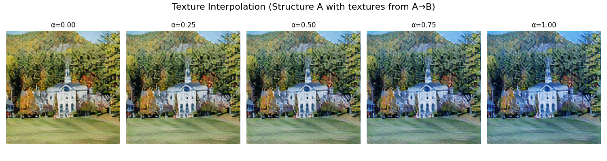

# Swapping Autoencoder Style Transfer

A style transfer model based on the [swapping autoencoder framework](https://arxiv.org/abs/2007.00653).

## Results

### Multiple Style Transfer Results

*Multiple style transfer results*

### Texture Interpretation

*Texture Interpretation results*